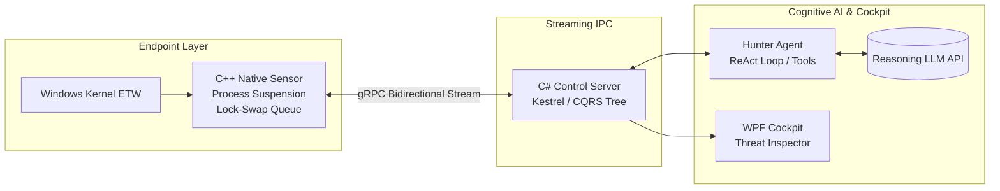
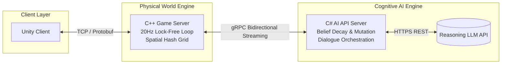

# Jin (naneunmuneo)
## About Me
정적분석 솔루션 [ARQA Static](https://kocome.com/solution)의 메인 시스템 엔지니어입니다.  
컴파일러 인프라 처리부터 비동기 데스크톱 아키텍처, 대규모 AI 파이프라인까지 복잡한 요구사항을 고성능 아키텍처로 구현하는 엔드투엔드(End-to-End) 시스템 엔지니어링에 집중하고 있습니다.
- **Core Focus**: 
  - **High-Performance & Kernel Systems**: Windows 커널 ETW 기반 텔레메트리 수집 및 저지연 프로세스 제어
  - **Compiler Tooling**: LLVM/Clang 기반 정적 분석(Static Analysis) 엔진 및 툴체인 구축
  - **Concurrent Architecture**: 논블로킹(Non-blocking) 동시성 제어 기반의 확장 가능한 서버/앱 아키텍처
  - **AI Orchestration**: 도구 호출(Tool Calling) 및 ReAct 루프 기반의 AI 에이전트 파이프라인 구축
- **Engineering Philosophy**: *"자유도 높은 시스템 속에서 정밀하게 통제 가능한 질서를 설계합니다."*

---

## Technical Matrix

### Languages
 

### OS & Kernel Internals
   

### Server Architecture & Profiling
 

### System & Infrastructure Core
    

### Data & AI Pipeline
  

### Frameworks & Client
  

### Build & Package Managers
 

---

## Pinned Projects

### Project Phalanx (AI-Augmented Windows EDR)
*Windows 커널 텔레메트리와 LLM 위협 분석 에이전트를 결합한 엔드포인트 탐지 및 대응(EDR) 시스템*

- **Architecture**: C++ 네이티브 센서와 C# 관제 서버 간의 **gRPC 양방향 비동기 스트리밍 파이프라인** 및 CQRS 기반 실시간 프로세스 트리 상태 관리 구축.
- **C++ Kernel Sensor**: Windows 커널 ETW 실시간 수집 및 `NtSuspendProcess`를 활용한 프로세스 일시 중지(Freeze) 제어. 워치독(SafetyWatchdog) 타임아웃 설계를 통한 수사 지연 시 프로세스 자동 재개 및 데드락 방지.
- **AI Threat Hunter**: VAD 순회를 통한 비정상 실행 메모리(Unbacked Memory) 탐지 및 페이로드 디코딩 등 수사 도구 연동. 정적 룰 오탐을 보정하고 LLM 판정에 따라 프로세스 종료/재개를 집행하는 의사결정 구조 설계.
- **SecOps Cockpit**: **점진적 공개(Progressive Disclosure) UI 패턴**을 적용한 WPF 기반 위협 관제 대시보드. UAC 권한 분리 및 Win32 이벤트(Named Event) 기반의 안전한 센서 기동/종료 제어.

---

### Project Mundus Vivens (AI AGENTS 자율 생태계 엔진)
*LLM의 추론 자유도와 게임 서버 시스템의 제어 가능성을 융합한 시뮬레이션 프로젝트*

- **Architecture**: C++ 게임 서버와 C# AI 인지 백엔드 서버 간의 **고성능 gRPC 양방향 비동기 스트리밍 파이프라인** 구축.
- **C++ Game Server**: 임계 구역(Critical Section) 대기 시간을 최소화하는 **더블 버퍼드 락-스왑(Lock-Swap) 기반 3-스레드 Proactor 모델** 및 공간 해시 그리드(Spatial Hash Grid) 기반 시뮬레이션 엔진 구현.
- **C# AI Engine**: 단기/중기/장기 메모리를 관리하는 **통합 믿음(Belief) 엔진** 설계. 에이전트 간 정보 전파와 시간 경과에 따른 쇠퇴(Decay) 및 변형(Mutation) 시뮬레이션.
- **Behavior & Survival**: 물리적 상태(허기/피로)에 따라 행동 계획을 즉시 중단하는 생존 인터럽트(Survival Override) 및 감정/상태 기반 반응 제어 로직 구현.

---

### GRC (Generative AI Roleplay Chat)
*LLM 기반의 인터랙티브 스토리텔링 및 롤플레잉 WPF 데스크톱 어플리케이션*

- **Memory Architecture**: 컨텍스트 윈도우 한계를 극복하기 위한 **3단계 계층형 메모리 압축 파이프라인**(Raw History -> Chapter Plot -> Chronicle) 설계.
- **TRPG Orchestration**: 에이전트 기반 세션 빌더 및 TRPG 룰/프롬프트 무결성을 실시간 검증하는 감사(Auditor) 루프 구현.
- **Multimodal Integration**: 실시간 오디오 스트리밍 연동 및 감정 가중치 기반 음성 합성(TTS) 파이프라인 구현.

---

## Connect with me

- **Email**: adg01008@naver.com
