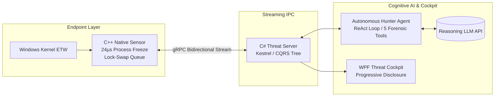
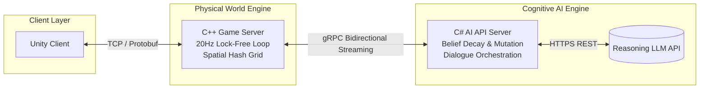

# Jin (naneunmuneo)
## About Me
정적분석 솔루션 [ARQA Static](https://kocome.com/solution)의 메인 시스템 엔지니어입니다.  
컴파일러 인프라 처리부터 비동기 데스크톱 아키텍처, 그리고 대규모 AI 파이프라인까지, 복잡한 비즈니스 요구사항을 고성능 아키텍처로 풀어내는 엔드투엔드(End-to-End) 시스템 엔지니어링에 집중하고 있습니다.
- **Core Focus**: 
  - **High-Performance & Kernel Systems**: Windows ETW 커널 텔레메트리 후킹 및 마이크로초(μs) 단위 지연 최소화를 위한 초저지연 액추에이션 설계
  - **Compiler Tooling**: LLVM/Clang 기반의 정적 분석(Static Analysis) 엔진 및 도구 체인 구축
  - **Concurrent Architecture**: 동시성 제어 및 논블로킹(Non-blocking) 기반의 확장 가능한 분산 서버/앱 아키텍처
  - **AI Orchestration & Observability**: 도구 호출(Tool Calling) 기반 자율 ReAct 수사 파이프라인, 비침투적 가관측성(Observability) 및 분산 환경에서의 자율 AI 에이전트 오케스트레이션
- **Engineering Philosophy**: *"자유도 높은 시스템 속에서 정밀하게 통제 가능한 질서를 설계합니다."*

---

## Technical Matrix

### Languages
 

### OS & Kernel Internals
   

### Server Architecture & Profiling
 

### System & Infrastructure Core
    

### Data & AI Pipeline
  

### Frameworks & Client
  

### Build & Package Managers
 

---

## Pinned Projects

### Project Phalanx (AI-Augmented Windows Kernel EDR Solution)
*Windows 커널 텔레메트리 후킹과 자율 LLM ReAct 위협 헌터를 결합한 2-Tier 엔드포인트 탐지 및 대응 솔루션*

- **Architecture**: C++ 네이티브 센서와 C# 관제 서버 간의 **gRPC 양방향 비동기 스트리밍 파이프라인** 및 CQRS 기반 실시간 프로세스 트리 프로젝션 구축.
- **C++ Kernel Sensor**: Windows 커널 ETW 실시간 후킹과 `NtSuspendProcess`를 활용한 **24μs급 원자적 프로세스 동결** 및 30초 SLA SafetyWatchdog 자동 재개/연장 페일세이프 엔진 구현.
- **Cognitive AI Hunter**: VAD 미할당 실행 메모리 스캔 및 다단계 페이로드 디코더 등 5대 포렌식 도구를 자율 구동하는 **ReAct 수사 루프** 및 정상 관리 행위 오탐을 원천 차단하는 **SSOT 의사결정 권한** 체계 설계.
- **SecOps Cockpit**: 침해 지표를 직관적으로 분석하는 **점진적 공개(Progressive Disclosure) WPF 관제 콘솔** 및 안전한 권한 분리를 위한 세션 로컬 수명주기 동기화 제어.

---

### Project Mundus Vivens (AI AGENTS 자율 생태계 엔진)
*LLM의 높은 추론 자유도와 전통적 게임 서버 시스템의 통제 가능성을 융합한 시뮬레이션 프로젝트*

- **Architecture**: C++ 게임 서버와 C# AI 인지 백엔드 서버 간의 **고성능 gRPC 양방향 비동기 스트리밍 파이프라인** 구축.
- **C++ Game Server**: 데이터 레이스를 방지하고 임계 구역(Critical Section) 대기 시간을 최소화하는 **더블 버퍼드 락-스왑(Lock-Swap) 기반 3-스레드 Proactor 모델** 및 공간 해시 그리드(Spatial Hash Grid) 기반의 틱 동기화 시뮬레이션 엔진 구현.
- **C# AI Engine**: 단기/중기/장기(Core) 메모리를 관리하는 **통합 믿음(Belief) 엔진** 설계. 에이전트 간의 정보 전파와 시간 경과에 따른 쇠퇴(Decay) 및 와전(Mutation)을 시뮬레이션화.
- **Behavior & Survival**: 물리적 생존 본능(허기/피로)이 발생하면 AI 대뇌의 일정을 즉시 인터럽트하는 생존 오버라이드(Survival Override) 및 과거 트라우마 기억을 바탕으로 공격성을 동적으로 제어하는 위협 억제 파이프라인(Threat Inhibition) 구축.

---

### GRC (Generative AI Roleplay Chat)
*LLM 기반의 고몰입도 롤플레잉 및 서사 창작용 WPF 데스크톱 어플리케이션*

- **Memory Architecture**: 컨텍스트 윈도우 한계를 극복하기 위해 대화 기록을 계층화한 **3단계 메모리 압축 파이프라인**(Raw History -> Chapter Plot -> Chronicle) 설계.
- **TRPG Orchestration**: 에이전트 기반 자율 TRPG 세션 빌더와 프롬프트 오류 방지를 위한 실시간 자율 감사관(Auditor) 루프 내장.
- **Multimodal Integration**: LLM 멀티모달 오디오 스트리밍 및 사용자 감정 가중치를 이용한 동적 분기형 TTS 연출 처리.

---

## Connect with me

- **Email**: adg01008@naver.com
