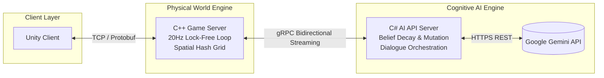

# Jin (naneunmuneo)
## About Me
LLVM/Clang 기반 정적분석 솔루션 [ARQA Static](https://kocome.com/solution)의 메인 시스템 엔지니어입니다.  
저수준 컴파일러 인프라 가공부터 비동기 데스크톱 어플리케이션 아키텍처 설계, 그리고 고성능 AI 파이프라인 엔진까지 아우르는 풀스택 시스템 설계 및 구현에 집중하고 있습니다.
- **Core Focus**: Low-level Systems, Compiler Infrastructure (LLVM/Clang), Asynchronous Programming, High-performance AI Integration
- **Engineering Philosophy**: *"자유도 높은 시스템 속에서 정밀하게 통제 가능한 질서를 설계합니다."*

---

##  Technical Matrix

### Languages
 

### Server Architecture & Profiling
 

### System & Infrastructure Core
    

### Storage & AI Pipeline
  

### Frameworks & Client
  

### Build & Package Managers
 

---

##  Pinned Projects

### Project Mundus Vivens (AI NPC 자율 생태계 엔진)
*LLM의 높은 추론 자유도와 전통적 게임 서버 시스템의 통제 가능성을 융합한 시뮬레이션 프로젝트*

- **Architecture**: C++ 게임 서버와 C# AI 인지 백엔드 서버 간의 **고성능 gRPC 양방향 비동기 스트리밍 파이프라인** 구축.
- **C++ Game Server**: 데이터 레이스를 방지하고 임계 구역(Critical Section) 대기 시간을 최소화하는 **더블 버퍼드 락-스왑(Lock-Swap) 기반 3-스레드 Proactor 모델** 및 공간 해시 그리드(Spatial Hash Grid) 기반의 틱 동기화 시뮬레이션 엔진 바닥부터 구현.
- **C# AI Engine**: 단기/중기/장기(Core) 메모리를 관리하는 **통합 믿음(Belief) 엔진** 설계. 에이전트 간의 정보 전파와 시간 경과에 따른 쇠퇴(Decay) 및 와전(Mutation)을 시뮬레이션화.
- **Behavior & Survival**: 물리적 생존 본능(허기/피로)이 발생하면 AI 대뇌의 일정을 즉시 인터럽트하는 생존 오버라이드(Survival Override) 및 과거 트라우마 기억을 바탕으로 공격성을 동적으로 제어하는 위협 억제 파이프라인(Threat Inhibition) 구축.
---

### GRC (Gemini Roleplay Chat)
*Google Gemini API 기반의 고몰입도 롤플레잉 및 서사 창작용 WPF 데스크톱 어플리케이션*

- **Memory Architecture**: 컨텍스트 윈도우 한계를 극복하기 위해 대화 기록을 계층화한 **3단계 메모리 압축 파이프라인**(Raw History -> Chapter Plot -> Chronicle) 설계.
- **TRPG Orchestration**: 에이전트 기반 자율 TRPG 세션 빌더와 프롬프트 오류 방지를 위한 실시간 자율 감사관(Auditor) 루프 내장.
- **Multimodal Integration**: Gemini 멀티모달 오디오 스트리밍 및 사용자 감정 가중치를 이용한 동적 분기형 TTS 연출 처리.

---

### MCP Context Feeder & AiAgent.Diagnostics
*AI 에이전트의 개발 효율성과 런타임 안정성 강화를 위한 독립 파이프라인 도구*

- **MCP Context Feeder**: 로컬 JSON-RPC 및 SSE 기반 통신 프로토콜을 사용하며, 권한 유무와 관계없이 에이전트의 안전한 읽기 지원. 
- **AiAgent.Diagnostics**: 비침투적 관찰(Observability) 설계를 적용하여, 프로덕션 실행 중 발생하는 오류 스택을 AI 에이전트가 자율 감지하고 코드 수정까지 도달하게 돕는 C# 디버깅 라이브러리.

---

##  Connect with me

- **Email**: adg01008@naver.com
- **Solved.ac Boj Profile**: [@naneunmuneo](https://solved.ac/naneunmuneo)
